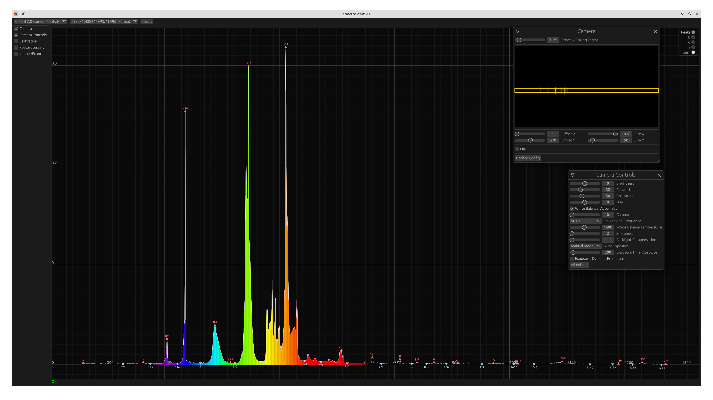
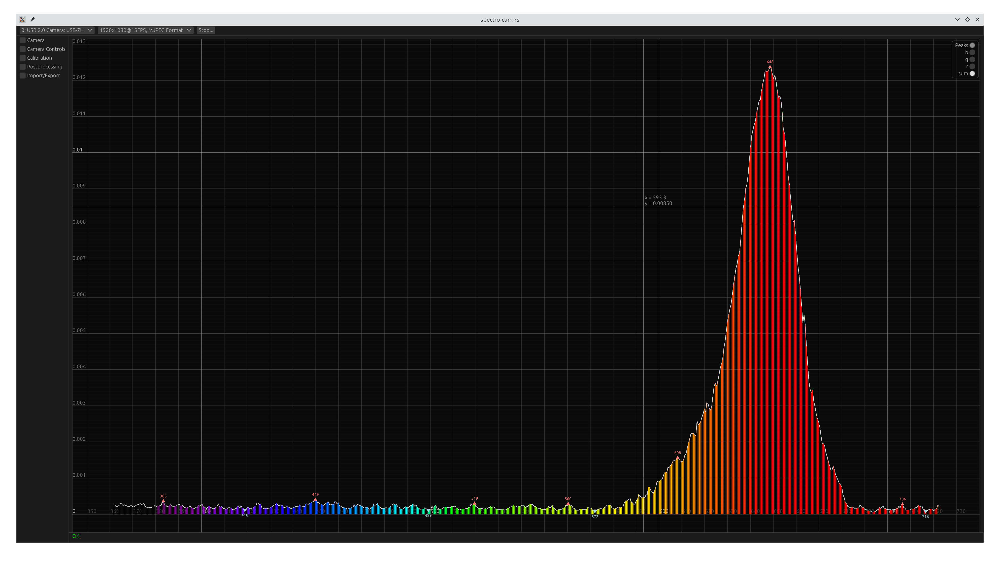
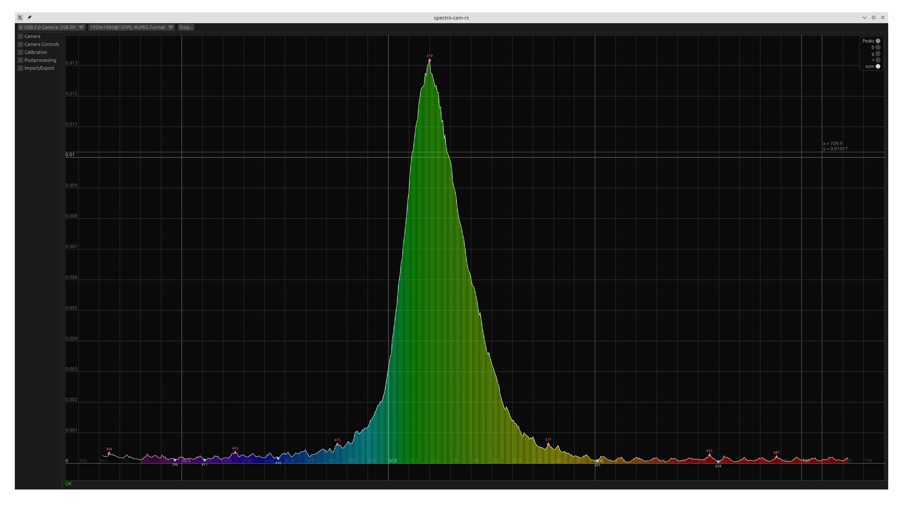
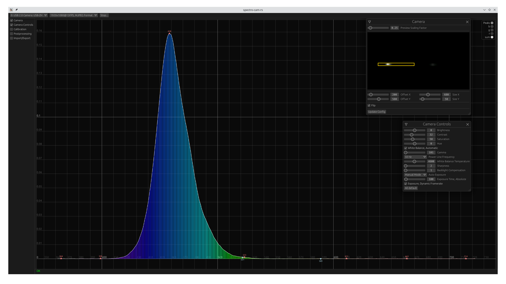
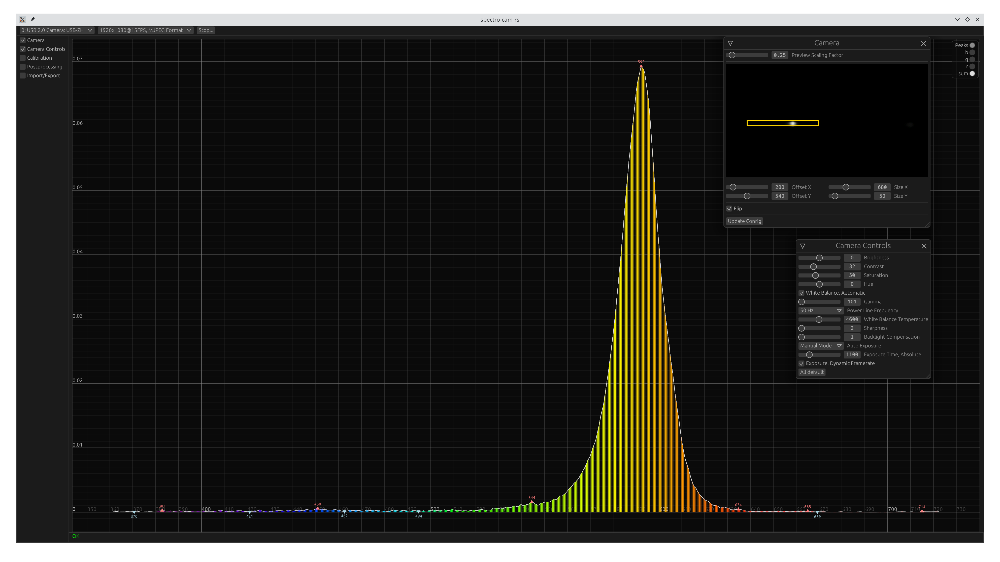
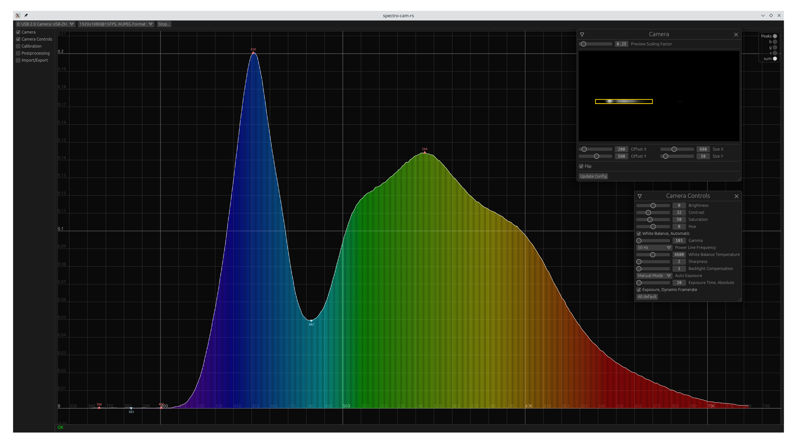
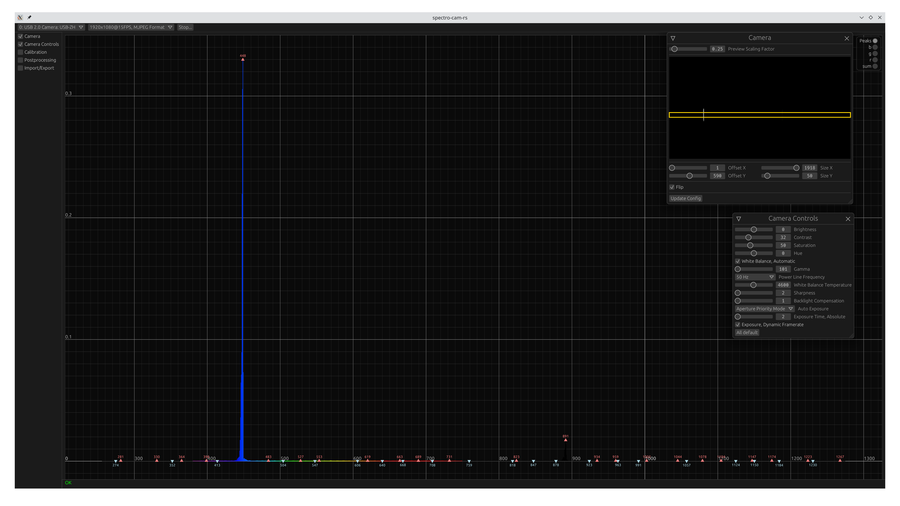
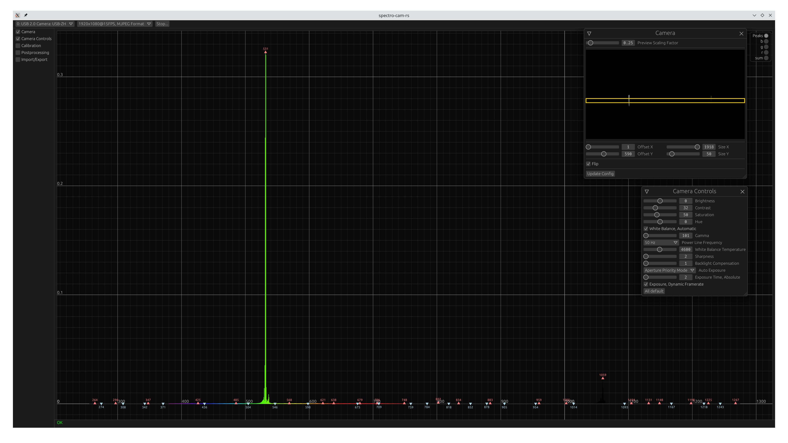
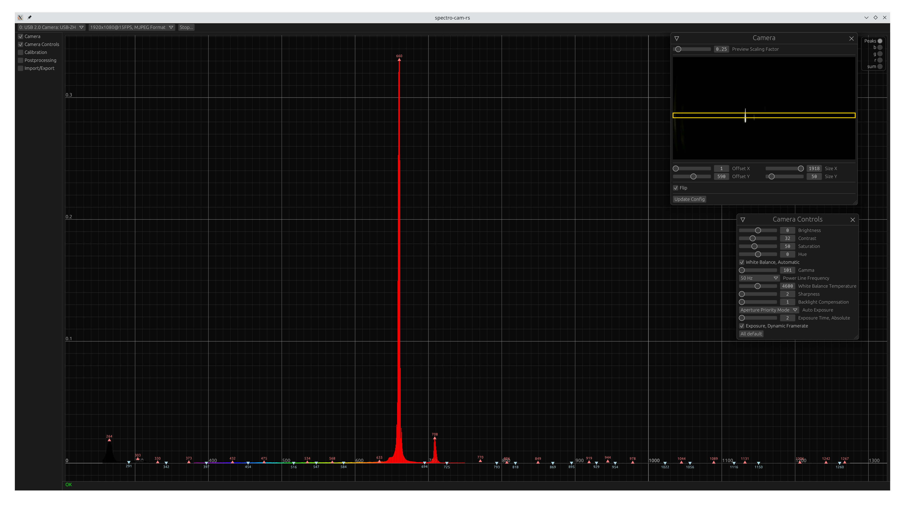

# **WIP**
# spectro-cam-rs

A cross-platform GUI for webcam-based spectrometers.

It should be a replacement for the Windows-only [Theremino Spectrometer][theremino] GUI since I only use Linux.

I use it with my [i-PhosHD][iphos] low-budget spectrometer.

## showing colors for visible spectrum

Using a "Little Garden" spectrometer (aliexpress).

Calibration with a fluorescent lamp: 

### LEDs
Red LED:

Green LED:

Blue LED:

Yellow LED:

White LED:

Blue laser:

Green laser:

Red Laser:

# Features

  - Adjustable webcam picture window size
  - Wavelength calibration
  - Per channel gain with presets
  - Linearization
  - Camera controls (Linux only at the moment)
  - Postprocessing (averaging buffer, low-pass filter, extraction of peaks and dips)
  - Absorption spectrography via zero reference
  - Calibration with imported reference or generated tungsten spectrum
  - Spectrum export
  - Multi-core support
  - Dark theme

# Limitations

  - Camera controls do not work on Windows and Mac
  - Not tested on Mac
  - Missing documentation
  - No pre-built binaries yet

# License

This program is licensed under either of

- Apache License, Version 2.0 ([LICENSE-APACHE](LICENSE-APACHE) or
  http://www.apache.org/licenses/LICENSE-2.0)

- MIT license ([LICENSE-MIT](LICENSE-MIT) or http://opensource.org/licenses/MIT)

at your option.

## Contribution

Unless you explicitly state otherwise, any contribution intentionally submitted
for inclusion in the work by you, as defined in the Apache-2.0 license, shall be
dual licensed as above, without any additional terms or conditions.

## Code of Conduct

Contribution to this crate is organized under the terms of the [Rust Code of
Conduct][CoC], the maintainer of this crate, [DerFetzer][team], promises
to intervene to uphold that code of conduct.

[CoC]: https://www.rust-lang.org/policies/code-of-conduct
[team]: https://github.com/DerFetzer
[theremino]: https://physicsopenlab.org/2015/11/26/webcam-diffraction-grating-spectrometer/
[iphos]: https://chriswesley.org/spectrometer.htm

